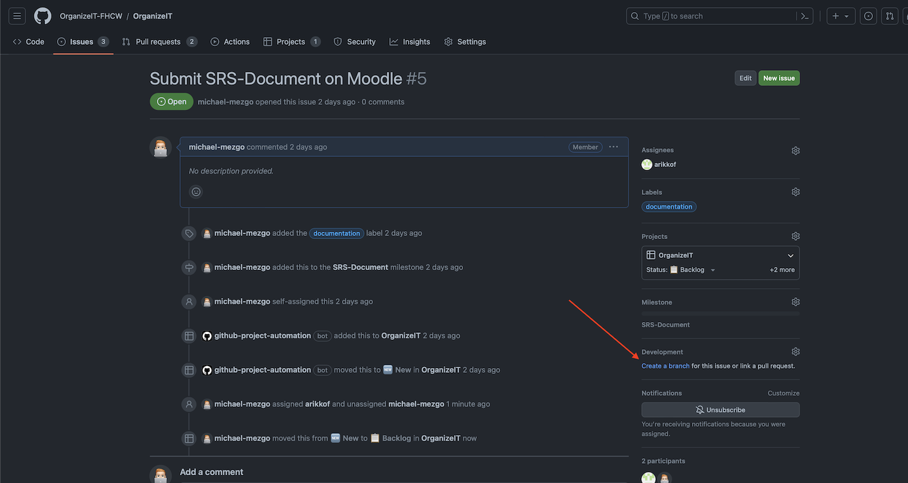
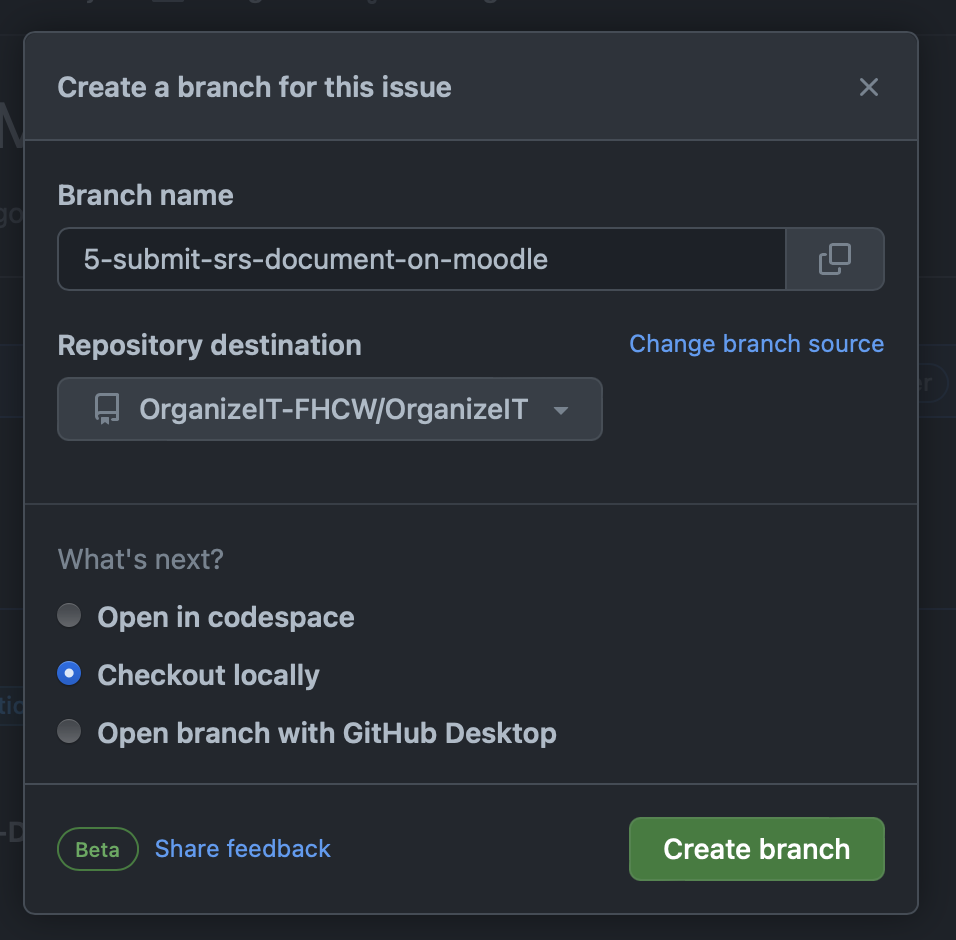
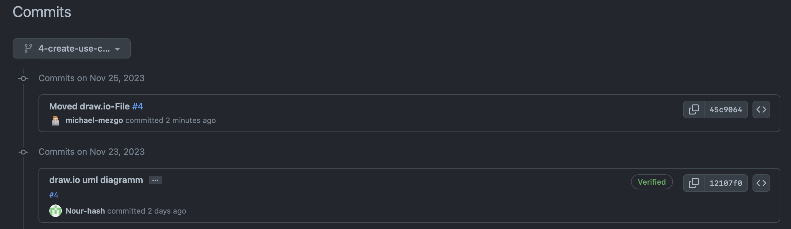
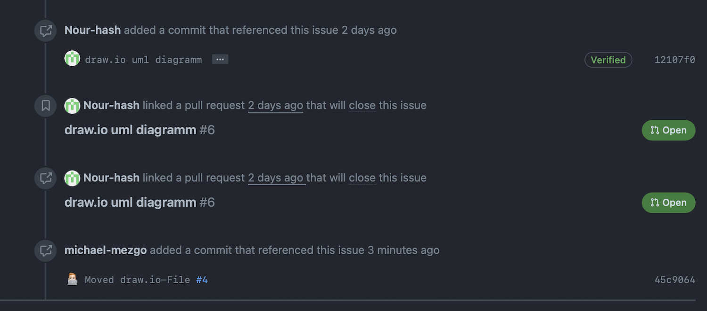
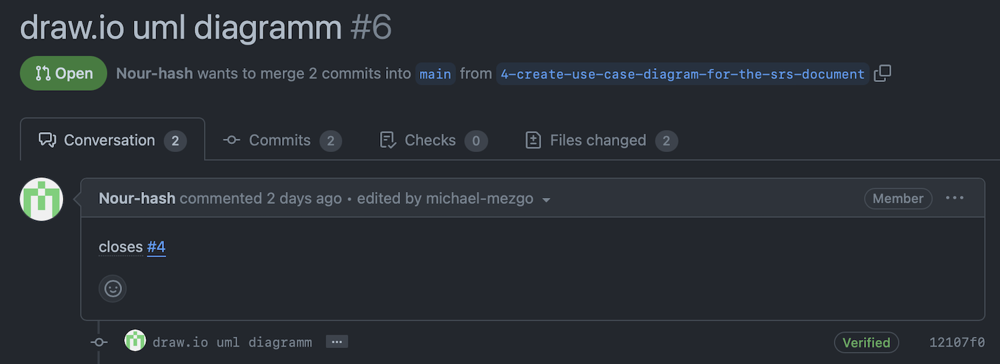

# Documentation Project Management (Documentation & Pull Requests)

> [!NOTE]
> Each commit must be linked to a card (=Issue)!
>
> Exceptions: Small activities (e.g. moving files)

## Create an issue

**The following fields should be filled in for each issue (task):**

* Title
* Description (Definition of done)
* Assignee (who is in charge of this task)
* Label
* Milestone (Must, Should, Could, Test, Organization, ...)

The issue is automatically added to the board with "github-project-automation".

## Workflow

> [!IMPORTANT]
> Each branch should be linked to an issue!

1. Create a branch for the issue

    

    The default branch name should not be changed!

    

2. Checkout and work locally
> [!IMPORTANT]
> Each commit should be linked to an issue!

    
    Therefore the issue number needs to be mentioned in the commitmessage.

    Example:

    ```Text
    Added use-case-diagram to the SRS-Document #ISSUE_NUMBER
    ```

    The commits are automatically linked to the issue. This makes it easier to track the progress of work.

    

3. Create a pull-request

    As changes cannot be pushed directly into the "main" branch, pull requests are required.

    To ensure that the issue is automatically closed after a successful merge, it is important that `closes #ISSUE-NUMER` is written in the description of the pull request.

    **The following fields should be filled in for each pull request (task):**

    * Title
    * Description (Definition of done) & `closes #ISSUE-NUMER`
    * Assignee (who is in charge of this task)
    * **Reviewers**

    A link to the issue is therefore also created. This makes it easier to track when and how work was completed.

    
